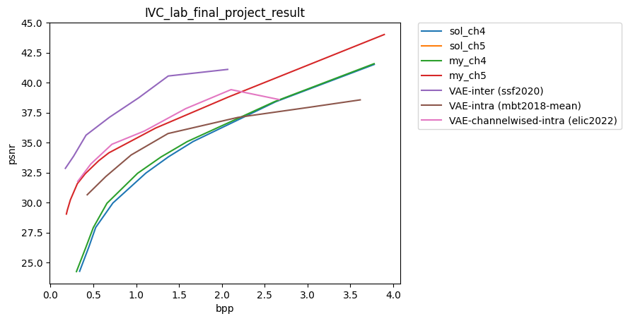

# CompressAI

[](https://github.com/InterDigitalInc/CompressAI/blob/master/LICENSE)
[](https://pypi.org/project/compressai/)
[](https://pypi.org/project/compressai/#files)

CompressAI (_compress-ay_) is a PyTorch library and evaluation platform for
end-to-end compression research.

## Result for IVC Lab Final Project




## Installation

CompressAI supports python 3.6+ and PyTorch 1.7+.

**From source**:

A C++17 compiler, a recent version of pip (19.0+), and common python packages
are also required (see `setup.py` for the full list).


```bash
git clone https://github.com/CristinaZN/CompressAI.git
cd CompressAI
pip install -U pip && pip install -e .
```


## Documentation

* [Installation](https://interdigitalinc.github.io/CompressAI/installation.html)
* [CompressAI API](https://interdigitalinc.github.io/CompressAI/)
* [Training your own model](https://interdigitalinc.github.io/CompressAI/tutorials/tutorial_train.html)
* [List of available models (model zoo)](https://interdigitalinc.github.io/CompressAI/zoo.html)

## Usage

### Examples(**for IVC lab**)

### Comparison AI intra-encoding with intra-encoding in CH4

#### train: for model `elic2022-chandelier` and `mbt2018-mean` 

**dataset(CLIC)**:

dataset for training can be obtained from https://clic.compression.cc/2021/tasks/index.html. After downloading the dataset, please arrange them in this style for training:

--dataset

----train

----val

----test

To train the model:

`cd CompressAI`

`python3 examples/train.py -m [model_name] -d ../dataset/ -e 200 -lr 1e-4 -n 4 --lambda 0.0125 --batch-size 4 --test-batch-size 4 --cuda --checkpoint-name ./lambda_0.0125`

Note: lambda is setting for balancing bpp and mse, which is chosen from [0.4, 0.2, 0.1, 0.05, 0.025, 0.0125, 0.00675].

#### evaluation: for model `elic2022-chandelier` and `mbt2018-mean` 

`cd CompressAI`

`python3 -m compressai.utils.eval_model checkpoint ../Chapter6_Template/foreman20_40_RGB/ -a [model_name] --cuda -m mse -d ./ -o [any_name] -p [model_weight.pth]`


### Comparison AI inter-encoding with inter-encoding in CH5 (using `mbt2018-mean` for intra-encoding)

**dataset (vimeo-90K)**:

dataset for training can be obtained from: http://toflow.csail.mit.edu/. (the Triplet dataset). After downloading the dataset, please arrange them in this style for training:

--datset

----sequences

------00001

--------img1

--------img2

--------img3

------00002

--------img1

--------img2

--------img3

...

----test.list (text file)

----train.list (text file)

#### train: for model `ssf2020` 

`
python3 examples/train_video.py -m ssf2020 -d [vimeo_triplet] -e 200 -lr 1e-4 -n 4 --lambda 0.4 --batch-size 4 --test-batch-size 4 --cuda --save --checkpoint-name ./lambda_0.4
`

Note: lambda is setting for balancing bpp and mse, which is chosen from [0.4, 0.2, 0.1, 0.05, 0.025, 0.0125, 0.00675].


#### evaluation: for model `ssf2020`

`cd CompressAI`

`python3 -m compressai.utils.video.eval_model checkpoint /Chapter6_Template/foreman20_40_RGB -p ./[model_weight.pth] --cuda -a ssf2020 ./`


## License

CompressAI is licensed under the BSD 3-Clause Clear License

## Contributing

We welcome feedback and contributions. Please open a GitHub issue to report
bugs, request enhancements or if you have any questions.

Before contributing, please read the CONTRIBUTING.md file.

## Authors

* Jean Bégaint, Fabien Racapé, Simon Feltman and Hyomin Choi, InterDigital AI Lab.

## Citation

If you use this project, please cite the relevant original publications for the
models and datasets, and cite this project as:

```
@article{begaint2020compressai,
	title={CompressAI: a PyTorch library and evaluation platform for end-to-end compression research},
	author={B{\'e}gaint, Jean and Racap{\'e}, Fabien and Feltman, Simon and Pushparaja, Akshay},
	year={2020},
	journal={arXiv preprint arXiv:2011.03029},
}
```

## Related links
 * Tensorflow compression library by _Ballé et al._: https://github.com/tensorflow/compression
 * Range Asymmetric Numeral System code from _Fabian 'ryg' Giesen_: https://github.com/rygorous/ryg_rans
 * BPG image format by _Fabrice Bellard_: https://bellard.org/bpg
 * HEVC HM reference software: https://hevc.hhi.fraunhofer.de
 * VVC VTM reference software: https://vcgit.hhi.fraunhofer.de/jvet/VVCSoftware_VTM
 * AOM AV1 reference software: https://aomedia.googlesource.com/aom
 * Z. Cheng et al. 2020: https://github.com/ZhengxueCheng/Learned-Image-Compression-with-GMM-and-Attention
 * Kodak image dataset: http://r0k.us/graphics/kodak/

